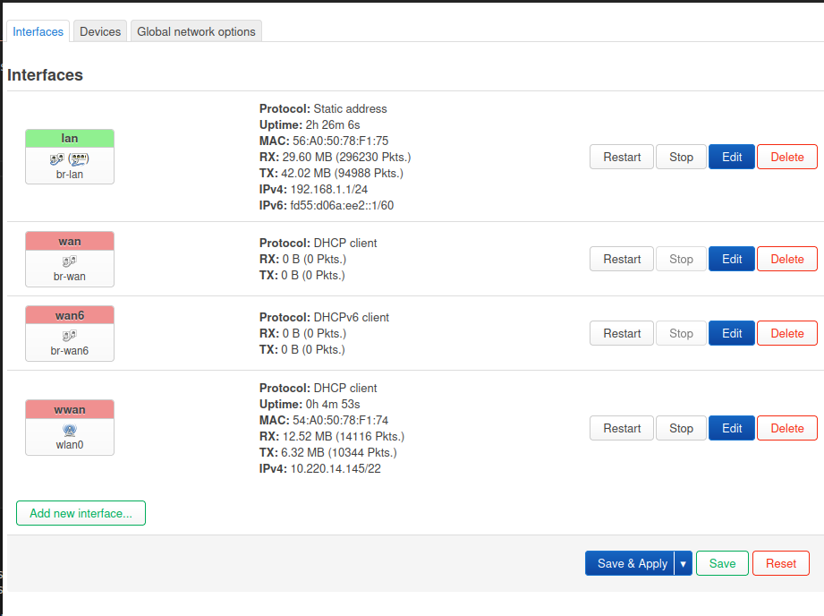
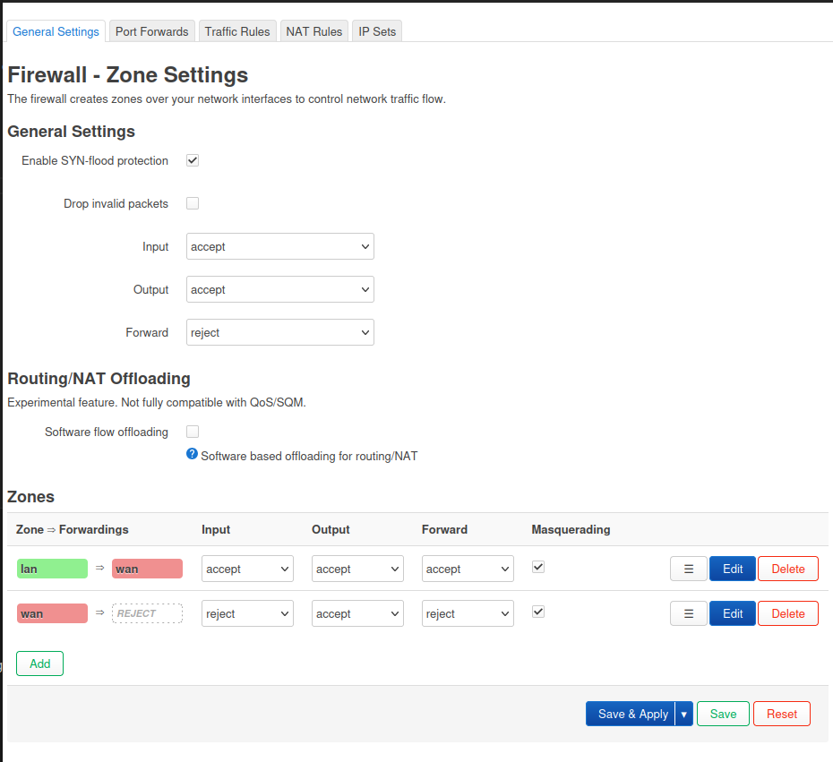
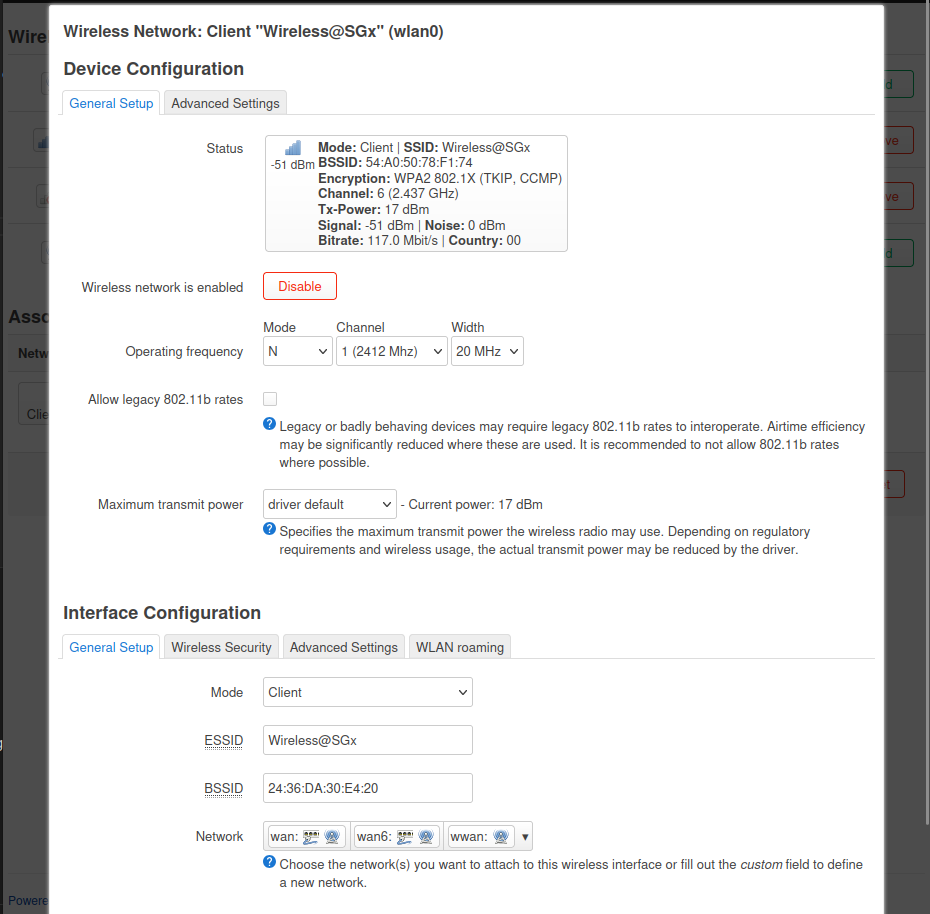
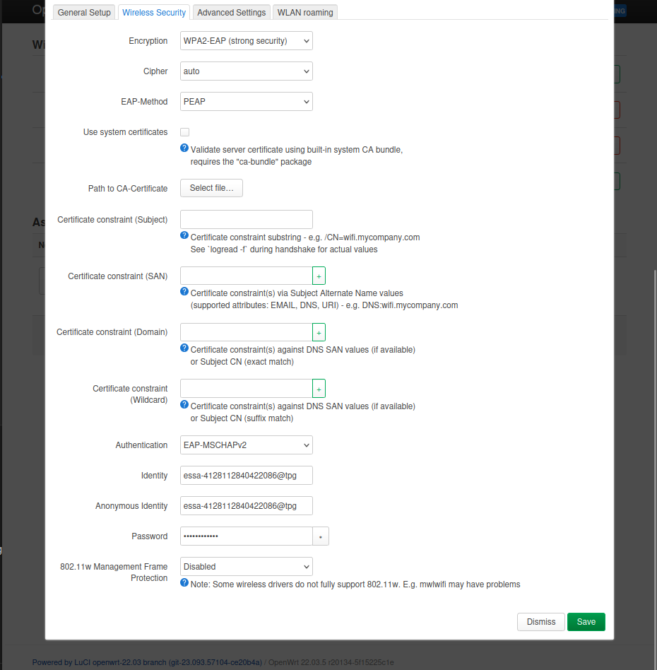

# wirelesssgx-router
Short Guide to setting up Internet Access Router LAN using wireless@SGx ( or similar networks with EAP )

## Use Case
It is often helpful to set up a LAN for networking purposes. However, we may not be able to access a dedicated WAN, as
1. The LAN may need to be portable ( uproot and deploy )
2. May not have access to WAN ( new environment )

A improvised WAN can be used. OpenWRT allows the following configurations ( and more ):
1. Dual Modem Routers: 1x uplink to wifi, 1x Access Point
2. Router with USB Port: 1x Usb Tethering from Phone to LAN

We document here configuration 1, where uplink is to wireless@SGx or equivalent EAP networks.

## Generate Credentials
1. goto: `https://eservice.imda.gov.sg/wirelessSGx/`
2. Select Device without local sim > Android / ChromeOS
3. Generate Credentials
 
## Installation
1. Setup OpenWRT Router and flash firmware: `https://openwrt.org/`
2. Connect router to internet ( For example, connect to existing Linux machine and set up LAN Network Sharing )
3. SSH to OpenWRT Router ( `ssh root@192.168.1.1` )
3. `opkg update`, `opkg install wpad` ( you may need to uninstall conflicting packages like `wpad-openssl` ). `wpad` is needed for support for EAP authentication.
4. `reboot`

## Configuration
1. Set up `luci` and configure router settings as desired.
2. Configure the following additional router settings:

