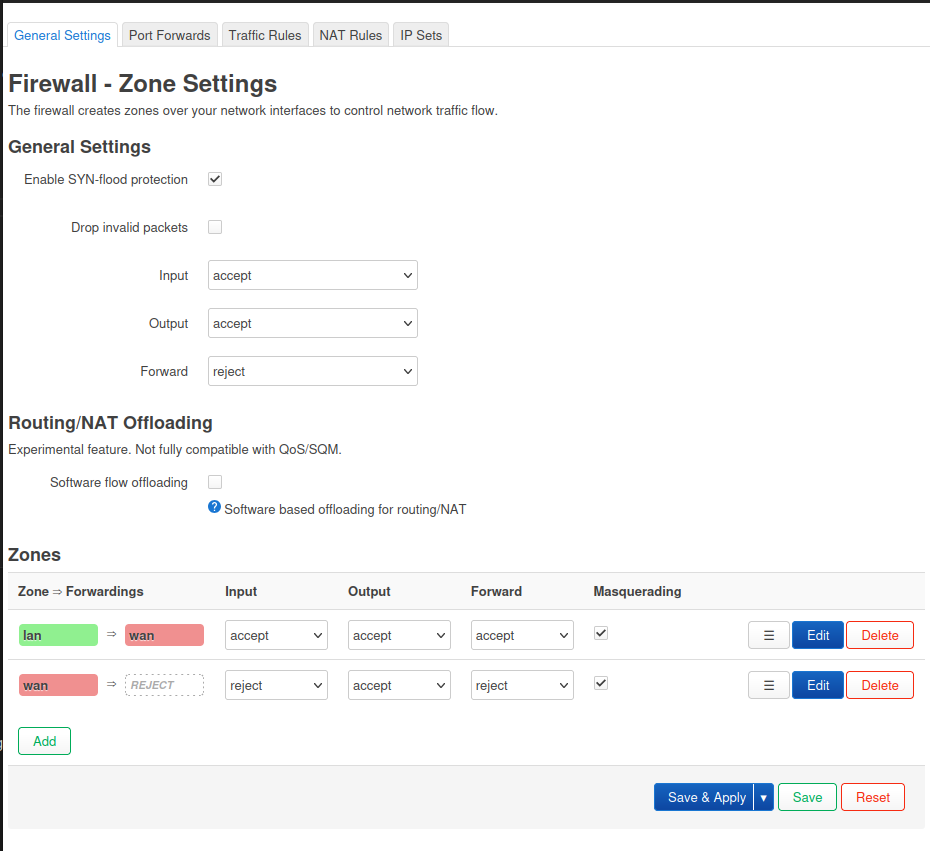
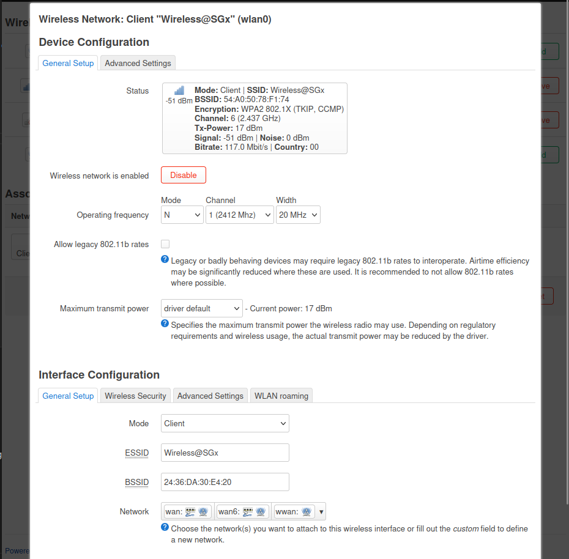
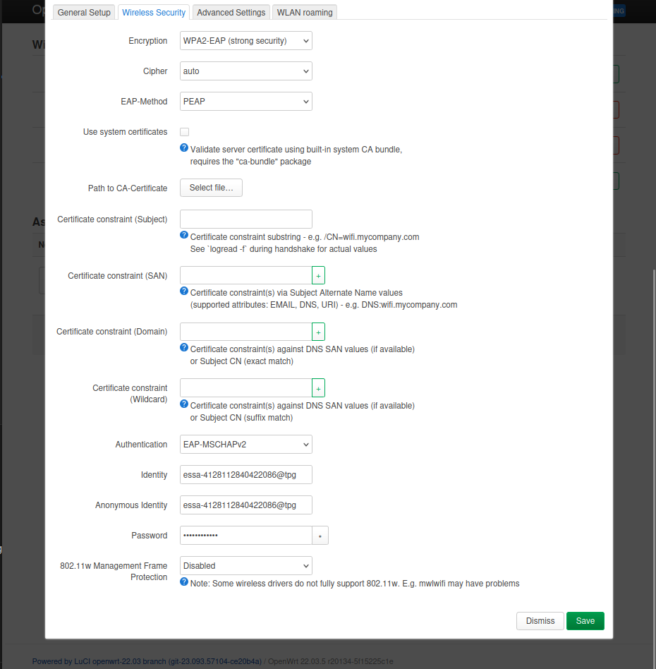

# wirelesssgx-router

## Generate Credentials
1. goto: `https://eservice.imda.gov.sg/wirelessSGx/`
2. Select Device without local sim > Android / ChromeOS
 
## Installation
1. Setup OpenWRT Router and flash firmware: `https://openwrt.org/`
2. Connect router to internet
3. `opkg update`, `opkg install wpad` ( you may need to uninstall conflicting packages )
4. `reboot`

## Configuration
1. Set up `luci`
2. Configure the following:

